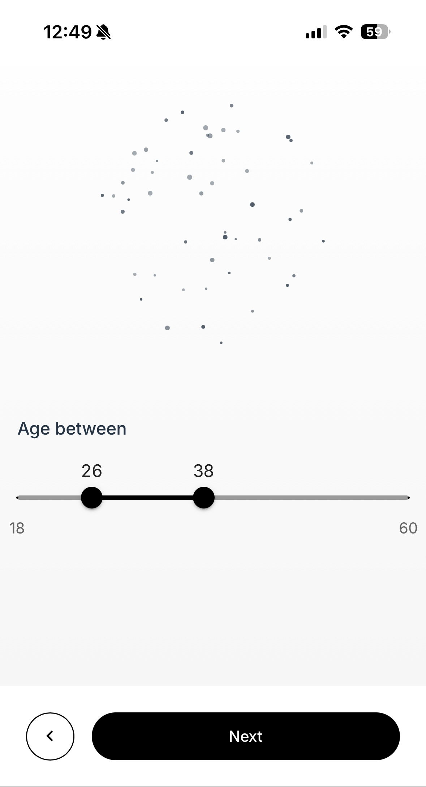

# My Chances to Find Love 

A web application that calculates your real chances of finding love using Census data and probability calculations inspired by the Drake Equation. Experience an interactive journey through personalized questions while watching a mesmerizing particle visualization that reflects your potential matches in real-time.

## 🌟 Features

- **Real-time Census Data**: Utilizes the U.S. Census Bureau API to fetch accurate demographic information for your city
- **Interactive Questionnaire**: Engaging step-by-step process to understand your preferences
- **Dynamic Visualization**: Beautiful particle-based visualization that responds to your choices

## 🛠️ Built With

- [React](https://reactjs.org/) - Frontend framework
- [Vite](https://vitejs.dev/) - Build tool
- [Material-UI](https://mui.com/) - UI components
- [Framer Motion](https://www.framer.com/motion/) - Animations
- [Tailwind CSS](https://tailwindcss.com/) - Styling
- [Census API](https://www.census.gov/data/developers/data-sets.html) - Demographic data

## 📱 Screenshots

### Desktop View

### Mobile View

## 🙏 Acknowledgments

- Inspired by the [Drake Equation](https://en.wikipedia.org/wiki/Drake_equation)
- Census data provided by the [U.S. Census Bureau API](https://www.census.gov/data/developers/data-sets.html)

## 📬 Contact

Alina Deng - [My Website](https://alinadeng.com)

---

⭐️ If you like this project, please give it a star on GitHub!